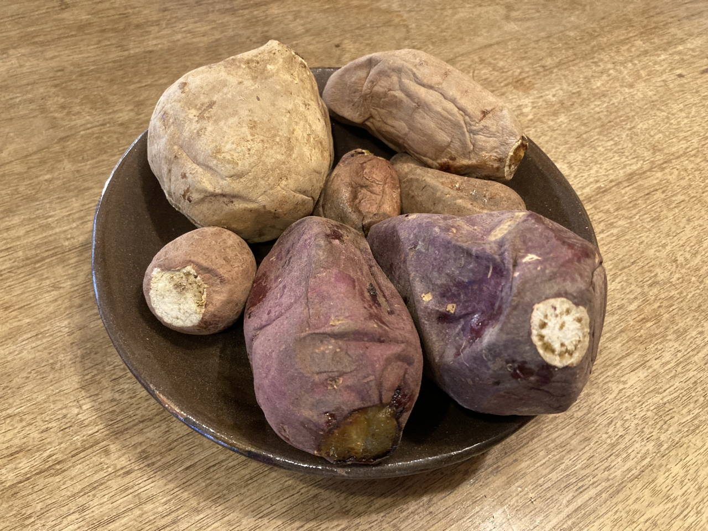

# 地元の焼き芋

地元の友人が焼き芋屋をやっていた。無農薬にこだわった焼き芋だそうだ。どれも甘かった。

大きさはバラバラで量り売りだった。相場はよく知らないが、この手の焼き芋にしてはお手頃だった。サービスしてくれたのかもしれない。

- 紅はるか
- 安納芋
- 隼人芋
- シモン芋（薬用芋）

最近はスーパ＝でも石焼き芋がよく売られているが、こんなに甘くて美味しい焼きたての焼き芋はなかなかない。帰省するたびに寄ろうと思う。

